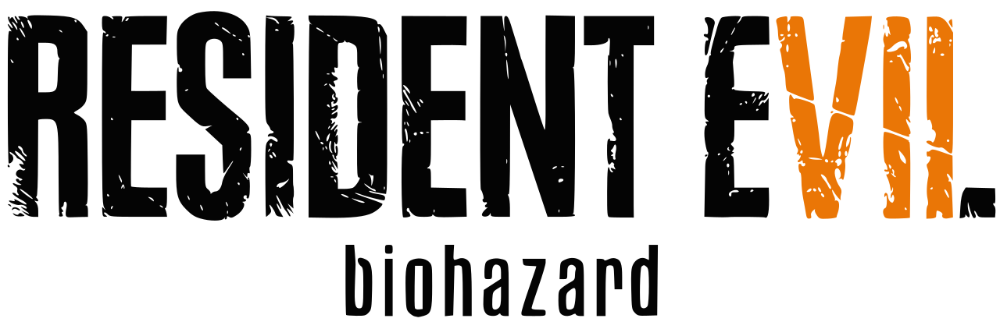

# re7-mac-controller-fix



Fixes wired controller detection for some unofficial Wine-wrapped macOS builds of Resident Evil 7.

If the controller fix works but fullscreen sizing breaks when switching between the MacBook display and an external monitor, see the `mixed-display-fullscreen-fix` branch.

## Disclaimer

This repo is for the wrapper fix only. It does not include the game, game files, or download links. Use it only if you have the legal right to use the software involved.

## What it does

- checks how the wrapper sees your controller
- patches the app launcher to export the needed SDL controller settings
- adds a known-good SDL controller mapping
- lets you undo the patch later

## Requirements

- macOS
- Terminal
- Homebrew

Install dependencies once:

```bash
brew install sdl2 pkg-config
```

## Quick start

Probe the controller:

```bash
./scripts/probe-controller.sh "/Applications/Resident Evil 7.app"
```

If the output shows `isGameController=0`, apply the fix:

```bash
./scripts/patch-re7.sh "/Applications/Resident Evil 7.app"
```

Then:

1. Fully quit the game.
2. Unplug the controller.
3. Plug it back in.
4. Launch `Resident Evil 7.app`.
5. Test the controller in-game.

If everything works except the D-pad or arrow directions, update to the latest repo version and run `./scripts/patch-re7.sh "/Applications/Resident Evil 7.app"` again.

## Optional fullscreen branch

If the controller fix works but fullscreen opens at the wrong size on different displays, use:

`mixed-display-fullscreen-fix`

That branch adds a launcher-side fullscreen mode selector for mixed-display setups.

## Custom mapping

If your controller uses a different SDL GUID, pass your own mapping:

```bash
./scripts/patch-re7.sh "/Applications/Resident Evil 7.app" 'GUID,name,a:b0,b:b1,...'
```

You can test a mapping before patching:

```bash
./scripts/probe-controller.sh "/Applications/Resident Evil 7.app" 'GUID,name,a:b0,b:b1,...'
```

## Undo

To restore the original launcher:

```bash
./scripts/revert-re7.sh "/Applications/Resident Evil 7.app"
```

## Notes

- This modifies the app bundle directly.
- Backups are stored under `Contents/Resources/re7-mac-controller-fix/`.
- The helper binaries are built as `x86_64` to match the wrapper runtime.
- The fix targets wrappers with files like `Contents/MacOS/Sikarugir`, `Contents/Frameworks/libSDL2-2.0.0.dylib`, and `Contents/SharedSupport/wine/bin/wine`.
